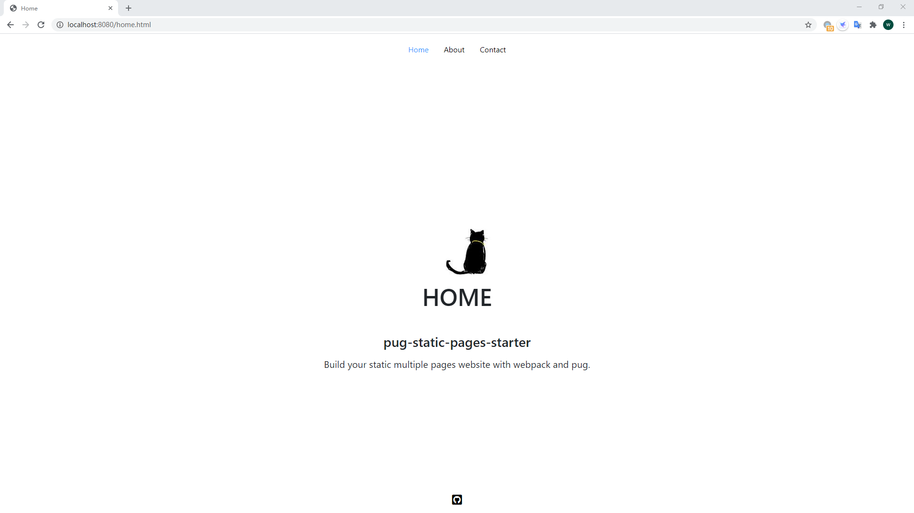

# pug-static-pages-starter
Build a static website with webpack and pug template engine. And it can help you make multipage HTML development suck less.

[Live demo](http://ethereal-flight.surge.sh/home.html)



## Feature List
- Bundle all your assets with webpack
- Use pug as a template engine
- live-reload
- Code splitting
- Multiple pages website
- Preprocess CSS with stylus and PostCSS
- Automatically build HtmlWebpackPlugin instance
- Use bootstrap & JQuery
- Use font-awesome

## Directory structure
```
.
├── dist
├── src
│   ├── assets
│   │   ├── images
│   │   └── fonts
│   ├── components
│   │   ├── footer.pug
│   │   └── header.pug
│   ├── css
│   │   ├── base.styl
│   │   └── variables.styl
│   ├── js
│   │   └── main.js
│   ├── layouts
│   │   └── default.pug
│   └── pages
│       ├── about.pug
│       ├── contact.pug
│       └── home.pug
│ 
├── .babelrc
├── .postcssrc.js
├── webpack.config.js
└── package.json
```

## License
[MIT](https://github.com/WaldenLiang/pug-static-pages-starter/blob/master/LICENSE)

Copyright (c) 2020 waldenliang

